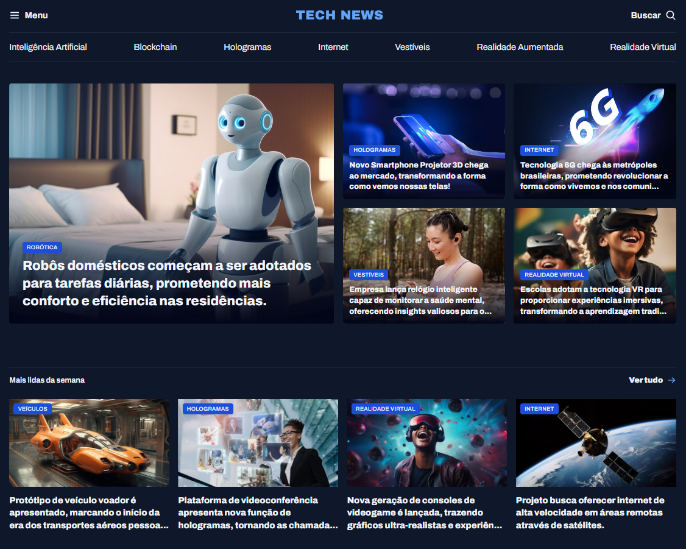
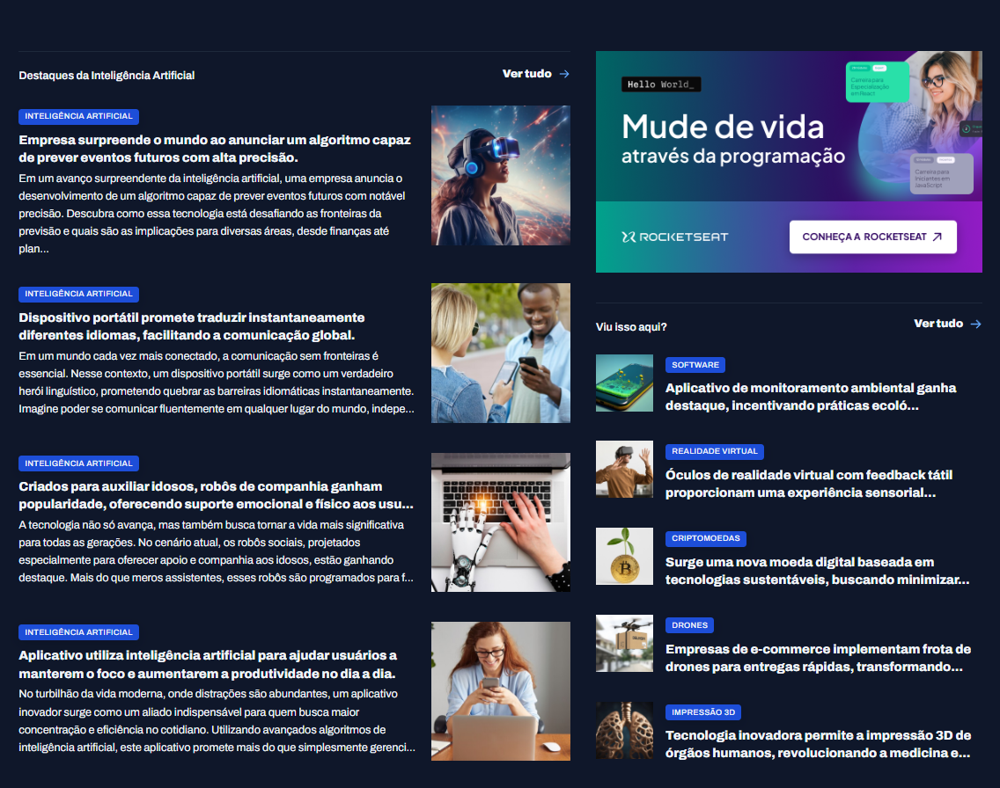

Projeto desenvolvido durante os estudos da Rocketseat com foco em HTML e CSS.

Portal de Notícias

Link: https://henriquemagno.github.io/portal-de-noticias/

Preview

Projeto desenvolvido durante os estudos da Rocketseat com foco em HTML e CSS.

Sobre o Projeto

Este projeto consiste em uma página de portal de notícias, desenvolvida para praticar conceitos fundamentais de:

- Estruturação semântica com HTML
- Estilização com CSS
- Grid Layout
- Organização de layout moderno

Tecnologias Utilizadas

- HTML
- CSS
